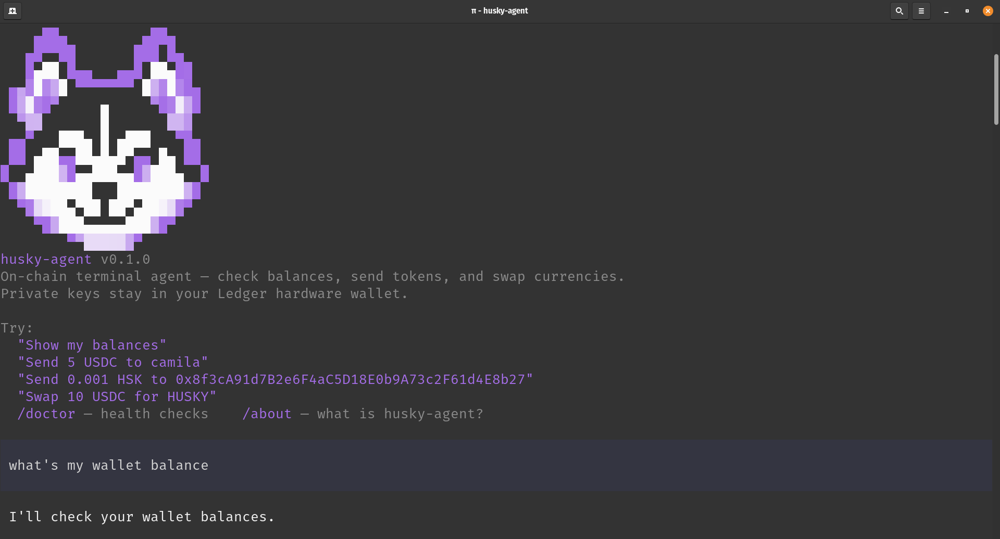

# Husky Agent



Husky Agent is a fully customizable, hardware-signed onchain agent for everyday
DeFi, built on Pi and HashKey Chain (HSK). Use natural language to transfer
tokens, swap assets, and inspect your wallet while keeping every transaction
under your control.

Bring your own LLM, add new skills and tools, configure your tokens and contacts,
or adapt the policies and approval flow to your workflow. The LLM never sees or
controls your signing keys: it interprets what you want to do, while deterministic
code builds and validates the transaction and a Ledger signs it only after your
explicit approval.

> Husky Agent currently runs on HashKey Chain Testnet (chain ID 133). Speculos,
> Ledger's hardware-wallet emulator, is used for local development.

## Why Husky Agent?

DeFi often asks users to work with contract addresses, token decimals, slippage,
gas, and opaque calldata. Giving an AI agent direct wallet access does not solve
that problem—it adds prompt-injection and hallucination risk to real money.

Husky Agent separates language understanding from transaction execution:

```text
your request
  -> intent interpretation
  -> deterministic resolution and transaction building
  -> simulation and policy checks
  -> plain-English transaction summary
  -> your explicit approval
  -> Ledger signing
  -> broadcast and confirmation
```

The summary is produced from decoded calldata, not from the model's description.
For swaps that need an allowance, the approval and swap are presented as one
validated plan before anything is signed.

## Agent installation

Requirements: Node.js 22.19 or newer, pnpm, and an API key for your preferred LLM
provider.

```bash
git clone https://github.com/paolacrispin/husky-agent.git
cd husky-agent && pnpm install && pnpm build
cp .env.example .env && cp .env.testnet.example .env.testnet
# Add your LLM provider, model, and API key to .env
pnpm dev
```

Husky Agent works with any provider and model supported by Pi. The default
configuration uses DeepSeek, but you can change `HUSKY_AGENT_PROVIDER`,
`HUSKY_AGENT_MODEL`, and the matching provider API key in `.env`.

## Try it

```text
What's my wallet address?
Show my balances
Send 5 USDC to juan
Send 0.001 HSK to 0xAbC...
Swap 10 USDC for HUSKY
Check the status of my last transaction
```

Before a transfer or swap is signed, Husky Agent shows exactly what it prepared
and asks you to approve or reject it. Anything other than an explicit approval
cancels the operation.

To use contact names such as `juan`, copy and edit the local contact list:

```bash
cp contacts.json.example contacts.json
```

Tokens can be customized in the same way:

```bash
cp tokens.json.example tokens.json
```

Both files are gitignored.

## Development with Speculos

Signing is required even during development. Husky Agent uses Speculos to
emulate a Ledger device locally, so you can test the complete approval and
signing flow without a physical wallet.

Make sure Docker is running, then start Speculos before testing a transaction:

```bash
pnpm speculos:start
pnpm speculos:status
pnpm dev
```

The first start downloads the pinned Ledger Ethereum app and configures blind
signing for the emulator. Open [http://127.0.0.1:5000](http://127.0.0.1:5000)
to view and operate the virtual device. Press both buttons to approve a
transaction.

When you are finished:

```bash
pnpm speculos:stop
```

Useful troubleshooting commands:

```bash
pnpm speculos:status
pnpm speculos:logs
```

See [`docs/08-getting-started.md`](docs/08-getting-started.md) for detailed setup
and troubleshooting, and [`ledger.md`](ledger.md) for the signing design.

> The mnemonic in `.env.testnet.example` is a shared testnet-only identity.
> Never send real funds to it or reuse it on another network.

## Customize the agent

Husky Agent is open source and designed to be adapted. You can:

- use a different Pi-supported LLM provider or model;
- add new agent skills and deterministic tools;
- configure allowed tokens, contracts, and named contacts;
- extend transaction policies, simulations, and approval rules;
- replace Speculos with a physical Ledger for production signing; and
- adapt the terminal experience to your own DeFi workflow.

The included shell disables automatic third-party skill and extension discovery
by default. Custom capabilities must be added deliberately so their permissions,
inputs, and transaction behavior can be reviewed.

## Development commands

```bash
pnpm build       # build the TypeScript workspace
pnpm typecheck   # run TypeScript checks
pnpm test        # run the test suites
pnpm dev         # start Husky Agent
```

The custom AMM lives in `packages/contracts` and uses Foundry. Its contracts are
already deployed on HSK testnet, so you do not need to redeploy them to run the
agent.

## Project structure

| Package | Purpose |
|---|---|
| `packages/agent` | Pi-powered terminal agent and DeFi tools |
| `packages/core` | Resolution, transaction building, simulation, policies, and summaries |
| `packages/signer` | Ledger and Speculos signing boundary |
| `packages/flashblocks` | Fast preconfirmation feedback while awaiting the final receipt |
| `packages/contracts` | Husky Agent AMM contracts |
