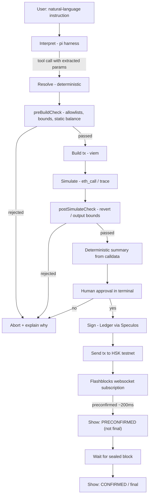

# 01 — Architecture

## Pipeline

```
interpret → resolve → preBuildCheck → build → simulate → postSimulateCheck
   → deterministic summary → human approval → sign → send
```

The policy engine is split into two checkpoints, not one stage — see
`04-security-policy-spec.md`. `preBuildCheck()` runs on the resolved intent (before
any tx object exists), so allowlist/balance rejections are cheap and never trigger
a build or a simulation. `postSimulateCheck()` runs on the built tx and its
simulation result, catching anything only observable after simulating (reverts,
out-of-bounds output amounts).



Swap with insufficient allowance is a special case of this same pipeline run
twice (once for `approve`, once for `swap`) before a single combined human
approval — see "Swap with insufficient allowance" in `04-security-policy-spec.md`.

## Interpretation runtime: the Pi agent harness

The "Interpret" stage runs on the **[Pi agent harness](https://github.com/earendil-works/pi)**
(`@earendil-works/pi-ai`), not a direct single-vendor API integration. Pi is
agent- and provider-agnostic: it exposes one unified completion API
(`Models.completeSimple`) over a catalog of providers (Anthropic, OpenAI,
DeepSeek, Google, ...), so which model actually answers a given instruction is
a runtime configuration choice — `HUSKY_AGENT_MODEL=<provider>:<model>` in
`.env` — not something baked into `packages/agent`'s code. See
`03-agent-tools-spec.md` for the exact tool schemas and `packages/agent/` for
the implementation.

Rationale: this stage is a narrow, embeddable NL → `{tool, params}` translator,
not an autonomous coding/engineering agent. Pi's completion API keeps the
model's capability surface identical to the two fixed tool schemas regardless
of which provider is configured — no filesystem, shell, or browsing access —
which is required by the non-negotiable principle in `AGENTS.md`. Swapping the
configured provider/model is a `.env` change, never an application-code
change; the deterministic pipeline downstream of "Interpret" has no
dependency on which provider answered.

## UX feedback via Flashblocks (testnet only)

After "Send," the CLI subscribes to HSK testnet's Flashblocks websocket
(preconfirmations every ~200ms) to give near-instant feedback, while waiting in
parallel for real confirmation in the sealed block. This is purely a latency-
perception improvement — **it changes nothing about the security pipeline or the
moment at which the operation is considered final.**

Non-negotiable UX rule: the "preconfirmed" state and the "confirmed/final" state
must be **visually and textually distinct** at all times (e.g. "⏳ Preconfirmed (HSK
Flashblocks) — awaiting finality" vs "✅ Confirmed in block N"). Never show the
preconfirmed state as if it were definitive. If Flashblocks is unavailable or the
subscription fails, the flow must degrade silently to just waiting for normal
confirmation — Flashblocks is a UX enhancement, not a critical pipeline dependency.

Matching: after sending, `packages/flashblocks` subscribes to
`wss://testnet-flashblocks.hsk.xyz/ws` and filters each incoming block diff's
transaction list for `tx.hash === submittedTxHash`. The first diff containing a
match flips the UI to "preconfirmed"; the subscription is torn down once the
normal RPC receipt for that hash confirms the sealed block (or on any error/close,
per the silent-degradation rule above).

## Responsibility per stage

| Stage | Owner | Deterministic | Input | Output |
|---|---|---|---|---|
| Interpret | LLM (via the Pi harness, provider configurable) | No | conversation (`Message[]`) | tool call: `{tool, params}` or a clarification message |
| Resolve | TS code | Yes | raw params (aliases, symbols) | canonical addresses and amounts (wei/units) |
| `preBuildCheck` | TS code (`packages/core`) | Yes | resolved intent | approved / rejected + reason |
| Build | TS code (viem) | Yes | resolved addresses/amounts | unsigned tx object(s) |
| Simulate | TS code (viem, eth_call) | Yes | unsigned tx | expected result or error |
| `postSimulateCheck` | TS code (`packages/core`) | Yes | tx + simulation result | approved / rejected + reason |
| Deterministic summary | TS code (template per tx type) | Yes | decoded tx | text shown to the user |
| Human approval | Terminal (stdin) | N/A (human) | summary | yes/no |
| Sign | Signing module (Speculos) | Yes | unsigned tx | signed tx |
| Send | viem | Yes | signed tx | tx hash / receipt |

Hard rule: **no stage after "Interpret" receives free-form text from the user or from
the LLM.** Everything crossing that boundary passes through the corresponding tool's
schema (see `03-agent-tools-spec.md`).

## LLM / deterministic code boundary

The LLM, whichever provider/model is configured via `HUSKY_AGENT_MODEL` and
called through the Pi harness, only has access to a fixed set of tools with
strict JSON schemas. The LLM chooses the tool and extracts parameters from
natural language, but:

- It doesn't know contract addresses or keys.
- It doesn't decide amounts in wei — it works with human-readable units (e.g. "10
  USDC") that the resolver converts.
- It doesn't see or build calldata.
- It cannot invoke the signer directly; the human-approval flow is outside its
  reach (it's an application step, not a tool the LLM could skip or repeat).

## Repo components (high level — detail in `06-repo-and-tooling.md`)

- `packages/agent/` — Pi harness client (provider-agnostic), tool definitions,
  system prompt.
- `packages/core/` — resolver, builder, simulator, policy engine, summary generator.
  No dependency on Pi, any provider SDK, or any LLM.
- `packages/signer/` — signing abstraction + Speculos implementation.
- `packages/contracts/` — AMM in Foundry.
- `packages/cli/` — the terminal that orchestrates everything and handles human
  approval.
- `packages/flashblocks/` — websocket client subscribing to HSK testnet Flashblocks,
  isolated from the rest (the security pipeline doesn't depend on this package).

## Chain

A single chain for everything: **HashKey Chain Testnet, chain ID 133**, RPC
`https://testnet.hsk.xyz` (confirmed against `hskchain/references/` — see the
explorer/WHSK notes in `06-repo-and-tooling.md`).
